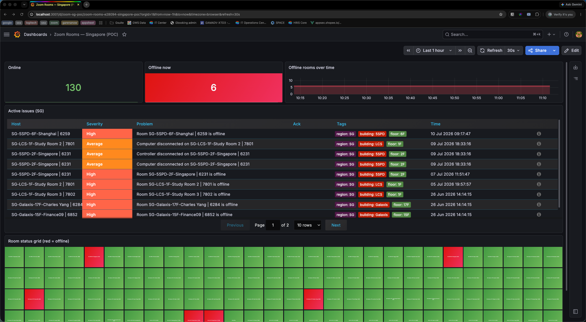
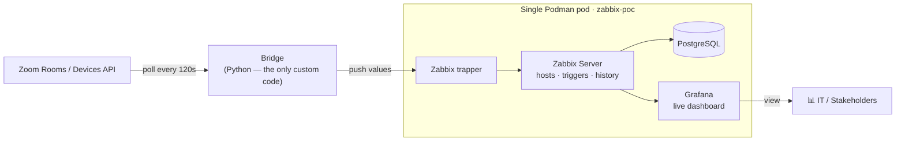

# Zoom Room Monitoring — Fleet Visibility POC

> **Know the moment a meeting room goes dark — across the whole fleet.**

A working proof-of-concept that monitors **real Zoom Rooms** through a battle-tested
**Zabbix + Grafana** stack, driven by a thin custom **bridge** that polls the Zoom API.
It's a faithful miniature of the approved production architecture — running today on
**136 live Singapore rooms**.


<!-- 📸 SCREENSHOT: capture http://localhost:3001/d/zoom-sg-poc, save it as
     docs/images/dashboard.png, and replace the placeholder URL below with:
      -->

> _Placeholder — swap for a real capture of `http://localhost:3001/d/zoom-sg-poc`._

---

## The problem

Meeting rooms fail **silently**. A controller drops off Wi-Fi, a room PC won't wake,
a device quietly unpairs — and nobody knows until someone walks into an important
meeting and the room is dead. At fleet scale, "wait for a ticket" isn't a strategy:
by the time a complaint arrives, the meeting is already ruined.

**This POC makes the invisible visible** — continuous, fleet-wide health for every
room, so IT sees the failure before the user does.

## What this proves

On **real data, today** — not a mockup:

- ✅ **136 real Singapore rooms** monitored as first-class hosts, tagged by region / building / floor.
- ✅ **Fleet-wide offline detection** with anti-flap (a room must miss **two** polls before it's flagged).
- ✅ **Device-disconnect detection** (room computer / controller) — catches *partial* failures, e.g. the PC is offline while the controller is still up.
- ✅ **Fleet-level rollup** — every poll cycle pushes online / offline / in-meeting totals to a dedicated summary host, so headline stats have real history, not per-panel math.
- ✅ **A live Grafana dashboard** — online/offline headline stats, offline-over-time history, an active-issues list, and a 136-tile status grid.
- ✅ Built on **production-grade open source** (Zabbix + Grafana) — the demo stack *is* the real architecture, just smaller.

## Architecture



**Why this shape:**

- **The bridge is the only software we maintain** — everything else is off-the-shelf.
- **Detection logic lives in Zabbix triggers, not code** — thresholds can be tuned without redeploying.
- **The path to production is additive** — call-quality metrics, real-time webhooks, RBAC and alerting all bolt onto this same architecture. Nothing built here is thrown away.

## See it live

Once the stack is up and the poller has run, open the dashboard at
**`http://localhost:3001/d/zoom-sg-poc`**. It shows:

- **Online / Offline now** — the two numbers that matter, at a glance.
- **Offline rooms over time** — trend history, top right (run the poller for a few days before a demo to populate it).
- **Active issues** — every currently-firing offline / device trigger, tagged by building and floor.
- **136-tile status grid** — the whole fleet on one screen; red = offline.

<!-- 📸 Optional: add a close-up of the status grid as docs/images/status-grid.png -->

## Quick start

> **Prerequisites:** macOS, [Podman](docs/SETUP.md) running, Python 3.11+, and a Zoom
> Server-to-Server OAuth app with room + device read scopes.

```bash
# 1. Bring up the Zabbix + Grafana stack (Podman)
cd deploy && ./zabbix-stack.sh up && ./configure-grafana.sh

# 2. Configure Zoom credentials, then verify scopes (read-only gate)
cd ../bridge && cp .env.example .env   # fill in ACCOUNT_ID / CLIENT_ID / CLIENT_SECRET
./run_check.sh                         # must print GATE PASSED

# 3. Provision Zabbix (host per room, templates, triggers) and start polling
./run_provision.sh
./run_poll.sh --loop                   # continuous; or run once without --loop to test

# 4. Import the dashboard
cd ../deploy && ./import-dashboard.sh  # -> http://localhost:3001/d/zoom-sg-poc
```

> **Grafana password gotcha:** Grafana forces you to change the admin password on
> your first UI login. After that, `admin:admin` stops working — pass your real
> password to the deploy scripts via env var:
> `GF_ADMIN_PASS=<your password> ./import-dashboard.sh` (same for
> `configure-grafana.sh`). The import fails loudly if credentials are wrong.

A healthy poll cycle prints:

```
[poll] rooms=136 offline=6 subset=5 items=292 -> processed: 292; failed: 0
```

**→ Full step-by-step walkthrough, troubleshooting, and operating notes in [`docs/SETUP.md`](docs/SETUP.md).**

### Keep it running across reboots

A macOS LaunchAgent (`deploy/com.zoomroom.poller.plist` + `deploy/poller-agent.sh`)
brings the Podman machine and stack up and keeps the poller alive unattended — ideal
for building multi-day history before a demo:

```bash
cp deploy/com.zoomroom.poller.plist ~/Library/LaunchAgents/
launchctl bootstrap gui/$(id -u) ~/Library/LaunchAgents/com.zoomroom.poller.plist
```

## Project layout

| Path | What's in it |
|---|---|
| [`bridge/`](bridge/) | The Python bridge: Zoom client, Zabbix trapper client, room→host mapper, provisioner, poller. |
| [`deploy/`](deploy/) | Podman stack (`zabbix-stack.sh`), Grafana wiring, dashboard import, and the reboot-durable LaunchAgent. |
| [`docs/`](docs/) | [`SETUP.md`](docs/SETUP.md) end-to-end guide + design specs under `docs/superpowers/specs/`. |

## Roadmap

| In this POC | Deferred to production (additive) |
|---|---|
| Offline + device-disconnect detection | Call-quality / QSS metrics |
| Singapore fleet (136 rooms) | Real-time webhooks (vs polling) |
| Dashboard-only | Multi-region RBAC |
| | Alerting to email / Teams / Slack |
| | Logitech Sync / Yealink enrichment |

Each deferred item is a step on the **same architecture** — see the design specs in
[`docs/superpowers/specs/`](docs/superpowers/specs/) for the full Phase-1 plan.

## Security

- Credentials live only in a **gitignored** `bridge/.env` — never committed. `.env.example` holds placeholders only.
- The POC uses simple Zabbix / Grafana passwords; change them for any shared or long-lived deployment. (Grafana already forces a new admin password on first login — see the quick-start note.)
- Rotate the Zoom client secret if it is ever exposed.

---

<sub>Proof-of-concept for evaluation. Built on Zabbix 7.0 LTS · Grafana OSS · Python · Podman.</sub>
