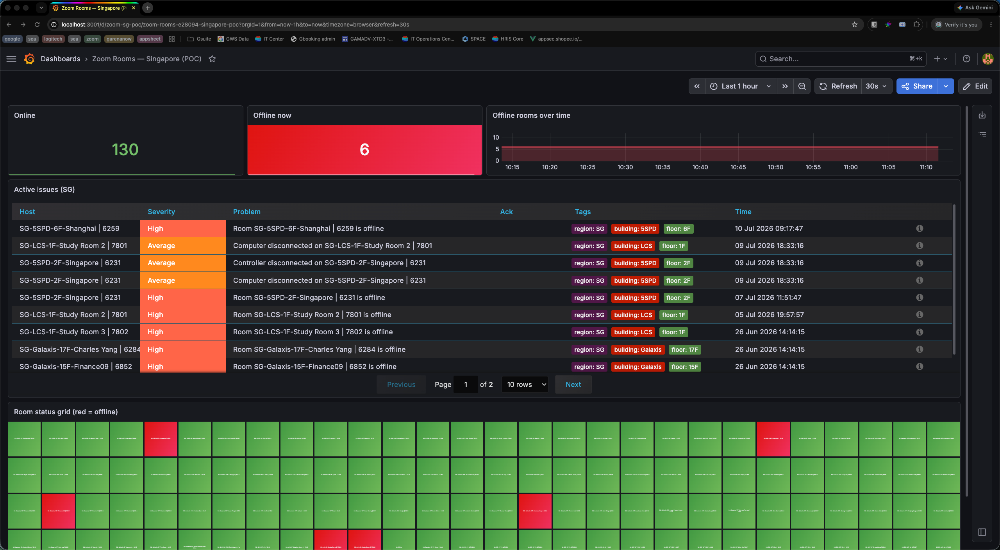
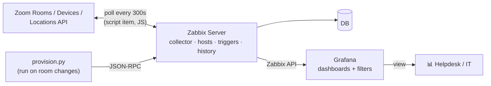

# Zoom Room Monitoring — Fleet Visibility

> **Know the moment a meeting room goes dark — across the whole fleet.**

Monitors **real Zoom Rooms** through a **Zabbix + Grafana** stack — with the poller
running **inside Zabbix itself** (a script item), so there is no extra server,
VM, or laptop to keep alive. Live today on **159 rooms in two regions**
(135 Singapore + 24 China/CNGR) on company infrastructure; scales to the
~700-room global fleet by config.




---

## The problem

Meeting rooms fail **silently**. A controller drops off Wi-Fi, a room PC won't wake,
a device quietly unpairs — and nobody knows until someone walks into an important
meeting and the room is dead. At fleet scale, "wait for a ticket" isn't a strategy.

**This makes the invisible visible** — continuous, fleet-wide health for every
room, so IT sees the failure before the user does.

## What it does

- ✅ **Every room a first-class Zabbix host**, named and tagged (building / floor)
  from the **Zoom location directory** — the source of truth, immune to
  room-name spelling drift.
- ✅ **Offline detection** fleet-wide with anti-flap (2 consecutive missed polls
  → High alert, ~10 min detection at the 5-min interval).
- ✅ **Device & peripheral alerting** from the Zoom dashboard metrics API (one
  fleet-wide call per cycle): controller disconnects, microphone / speaker /
  camera issues, battery — alerts named by the issue text itself and sourced
  from the same feed as Zoom's own Room Health page (the devices API's status
  field proved unreliable, so it's history-only). Suppressed while the whole
  room is offline — one incident, one row.
- ✅ **Multi-region by env vars** — regions without a shared room-name prefix
  are selected by their **location-directory subtree** (that's how CNGR runs);
  each region gets its own host group, fleet rollup, and collector.
- ✅ **Self-monitoring feed** — the collector reports its own cycle summary and
  a `nodata` watchdog trigger fires if it ever stops.
- ✅ **Grafana dashboards for helpdesk**: Building/Floor filters (each team sees
  their own rooms), filtered online/offline stats, active-issues work queue,
  fleet status grid, resolved-issues history, and per-room 30-day drill-downs.
- ✅ **Everything as code** — provisioning, the collector, and the dashboards
  live in this repo; every piece is idempotent and re-runnable.

## Architecture


```mermaid
flowchart LR
    Z["Zoom Rooms / Devices /<br/>Locations API"] <-->|"poll every 300s<br/>(script item, JS)"| S["Zabbix Server<br/>collector · hosts · triggers · history"]
    S --> P[("DB")]
    S -->|Zabbix API| G["Grafana<br/>dashboards + filters"]
    B["provision.py<br/>(run on room changes)"] -->|JSON-RPC| S
    G -->|view| U["📊 Helpdesk / IT"]
```

**Why this shape:**

- **Zero custom infrastructure** — the collector (`bridge/collector.js`) runs *inside*
  the Zabbix server as a script item and feeds the same trapper items via
  `history.push`. Nothing to host, restart, or babysit.
- **Detection logic lives in Zabbix triggers, not code** — thresholds tune without redeploys.
- **The location directory drives structure** — move a room in Zoom, re-run
  provisioning, and hosts/tags/dashboard filters follow.

## Quick start (existing Zabbix + Grafana)

> **Prerequisites:** Zabbix 6.4+ whose server has outbound HTTPS to `api.zoom.us`,
> an account/API token with host+template create rights, Grafana with the Zabbix
> app plugin, and a Zoom Server-to-Server OAuth app (room/device/location read
> scopes). Full checklist + verification steps: [`docs/SETUP.md`](docs/SETUP.md).

```bash
# 1. Configure credentials
cd bridge && cp .env.example .env      # fill in Zoom + Zabbix values

# 2. Gate check (Zoom scopes, read-only)
./run_check.sh                         # must print GATE PASSED

# 3. Provision Zabbix: host group, 3 templates, one host per room
./run_provision.sh                     # idempotent — re-run on room changes

# 4. Install the in-Zabbix collector (script item + secret macros + watchdog)
./run_install_collector.sh             # data flows within one 5-min cycle

# 5. Import the dashboards into Grafana (UI: Dashboards -> New -> Import)
#    upload from deploy/upload-to-grafana/ — it contains ONLY the importable
#    files; each import prompts for your Zabbix datasource.
```

Healthy collector value (Monitoring → Latest data → `zoom.bridge.run`):

```
{"rooms":135,"offline":4,"subset":15,"items":326,"failed":0}
```

**Sizing:** all alerting runs on per-cycle fleet-wide feeds, so it doesn't scale
with room count. The rotating device sweep (`ceil(rooms / subset_size) × interval`)
only sets how fresh the per-room device version/timeline data is — subset 15
sweeps 135 rooms in ~45 min; at ~700 rooms use `PERIPHERAL_SUBSET_SIZE=30` (~2h).

## Project layout

| Path | What's in it |
|---|---|
| [`bridge/`](bridge/) | `collector.js` (the in-Zabbix poller) + `install_collector.py`, `provision.py` (hosts/templates/triggers from the Zoom location directory), scope checker, and a standalone Python poller for local testing. |
| [`deploy/`](deploy/) | Grafana dashboard JSONs — upload from [`upload-to-grafana/`](deploy/upload-to-grafana/) (importable files only) — plus the self-contained local demo stack (Podman) and its scripts. |
| [`docs/`](docs/) | [`SETUP.md`](docs/SETUP.md) build guide · [`LOCAL-POC.md`](docs/LOCAL-POC.md) laptop demo · design specs under `docs/superpowers/specs/`. |

## Local demo mode

The original POC ran this entire stack self-contained on one laptop — Zabbix +
Grafana in a Podman pod, polled by `run_poll.sh` (or a reboot-durable macOS
LaunchAgent). That mode still works for demos without touching shared
infrastructure: `deploy/zabbix-stack.sh up` and follow [`docs/LOCAL-POC.md`](docs/LOCAL-POC.md).

## Roadmap

| Done | Next (additive) |
|---|---|
| Offline + device-disconnect detection | Zoom webhooks (real-time events; polling stays as safety net) |
| SG + CNGR fleets on company Zabbix/Grafana | Remaining countries (~700 rooms) — per-region env config + dashboard copy |
| Mic / speaker / camera / battery alerts (dashboard metrics API) | Alerting to email / Teams / Slack |
| Building/Floor helpdesk filters · location-directory naming | Call-quality / QSS metrics · Logitech Sync / Yealink enrichment |

## Security

- Credentials live only in the **gitignored** `bridge/.env` and as **secret host
  macros** in Zabbix — never committed, never in dashboards.
- All Zoom scopes are read-only. Rotate the client secret / API tokens on
  exposure: update the macro and re-run the installer.

---

<sub>Built on Zabbix · Grafana OSS · Python · and one JavaScript file that replaced a server.</sub>
